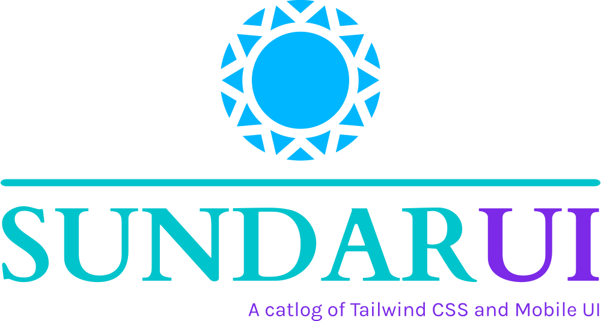

# SundarUI

  
Discover a vast library of open-source Tailwind CSS components and Mobile UI design elements 🚀

  
  
  
  

# Features

SundarUi provides the following features:

- Production-ready Ui Components for website and mobile app

